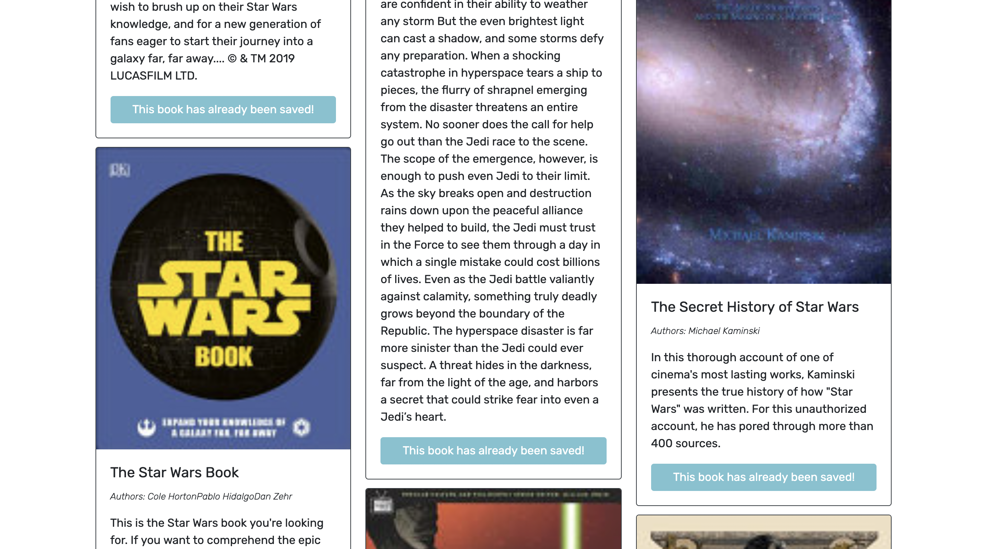
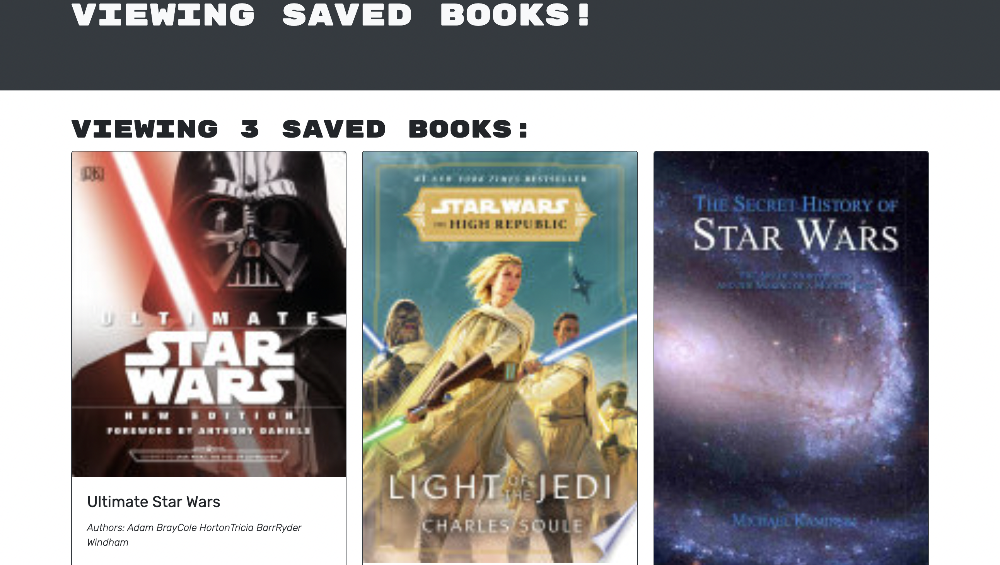

# Book Engine Search Project

## Table of Contents
            
- [Description](#Description)
- [Usage](#Usage)
- [Questions](#Questions)

### Description
For this project, I was tasked to finish an application that searches for any book on the Google Books API. When you have logged in, you will be able to save the books you searched for into your saved books database. To do this, I started by reworking all of the server code from a RestfulAPI to an Apollo Server. After adding all of the necessary code, I downloaded Apollo Express Server and Apollo Client so that Apollo could run on the application. Once running, I updated the routes and controller to be a TypeDefs and Resolvers. Once this was done, I was able to move into the client and update the API routes to use queries and mutations on the front-end. This allowed me to be able to log in and start saving books to my user.

SAVED BOOKS:

With the books saved, I could then view them on the saved books page and delete them if I no longer wanted them saved. To do this, I updated the remove book API to use the remove book mutation and added a cache update of saved books so that the delete books page would automatically update when the user clicks delete.

DELETE BOOKS:

### Usage
To use this application, you need to open the project's site and click on the search bar and search any book you wish to. You will see a list of books appear. To be able to save them, you will need to log in or sign up for an account. After clicking on login in the top right corner, sign up for an account. Once logged in, search for your book of choice and you will now see a button to save the book. When you have selected your books, you can go to the saved books page and delete the books you no longer want to save. 

You can view the website here: https://secure-scrubland-90432.herokuapp.com/

### Questions
My Github: https://github.com/morrisbianco

andrewbianco98@gmail.com: Please contact me through this E-mail address with any further questions that you may have.
            